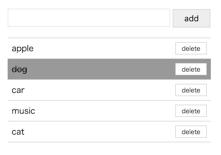

# REST API Todo Demo using Express of Node.js




## Spec


### Server side

* Express

### Client side

* React.js
* Babel + ES2015


## install

1) install node package

```
npm install
```

2) build client javascript

```
gulp bundle_debug
-> debug build

or

gulp bundle_release
-> release build
```

3) launch web server

```
node app/static_web.js
```

4) launch api server

```
node app/api.js
```

5) access web page in browser

```
http://localhost:3002/
```


